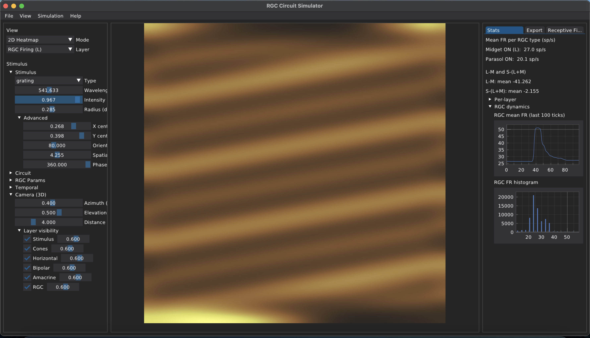
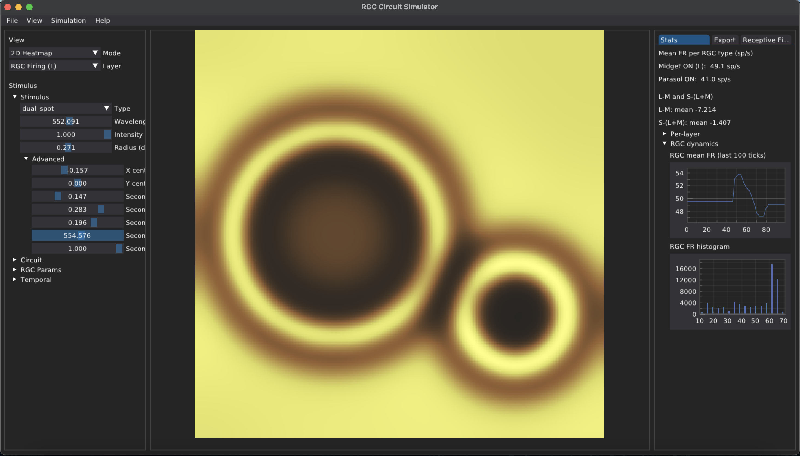

# RGC Circuit Simulator





Retinal ganglion cell circuit simulator: stimulus → cones → horizontals → bipolars → amacrines → RGCs. Vectorized NumPy/SciPy pipeline, ModernGL 3D rendering, Dear PyGui.

## Quick Start

```bash
python -m venv .venv
source .venv/bin/activate   # or .venv\Scripts\activate on Windows
pip install -r requirements.txt
python main.py
```

## Overview

- **Simulation**: L/M/S cone spectral response, horizontal surround feedback, ON/OFF bipolar split, amacrine lateral inhibition, LN RGC nonlinearity. Grid-based, vectorized.
- **Stimuli**: Spot, full-field, annulus, bar, grating, checkerboard. Monochromatic via cone fundamentals (Stockman & Sharpe 2000).
- **Visualization**: 2D heatmap per layer or 3D stack (planes + cell spheres). Mouse orbit, scroll zoom.
- **RF probe**: 24x24 sweep, DoG fit (sigma_center, sigma_surround, ratio).
- **Export**: PNG screenshot, CSV stats, NPY layer grids.

## Stack

NumPy, SciPy, Numba, ModernGL, Dear PyGui, colour-science, Pillow, scikit-image.

## Layout

```
src/
├── config.py           # Biological constants, layer z-positions
├── simulation/
│   ├── pipeline.py     # Master tick(), vectorized layer updates
│   ├── state.py        # SimState dataclass
│   ├── layers/         # cones, horizontal, bipolar, amacrine, rgc
│   ├── stimulus/       # spectral.py (spot, bar, grating, etc.)
│   └── rf_probe.py     # Probe sweep, DoG fit
├── rendering/
│   ├── context.py      # ModernGL FBO, render_3d()
│   ├── heatmap.py      # Grid → RGBA colormaps
│   └── scene_3d/       # layer_planes, cell_spheres, camera
└── gui/
    ├── app.py          # Dear PyGui main loop, panels
    └── panels/         # data_export

hot_numerical/          # Cython templates for numerical hotspots (not yet integrated)
```

## TODO

- Implement multi-color / multi-object stimuli
- Refine 3D viewer
- Add more detailed statistics
- Add connectivity specs
- Refine parameters available when each stimulus is selected
